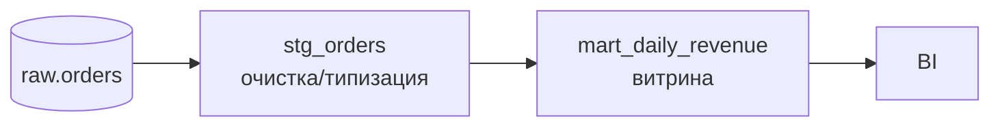

# dbt-analytics-demo


Аналитические витрины на **dbt**: staging → marts, с тестами качества и документацией.
Показывает трансформации как код (версионируемые, тестируемые) — стандарт современного DWH.

## Архитектура слоёв


## Что демонстрируется
- Слоистая модель (staging / marts) и ref-зависимости dbt.
- **Тесты dbt**: `not_null`, `unique`, `accepted_values` — DQ как часть сборки.
- Инкрементальная материализация витрины (`incremental`).
- Документация и lineage (`dbt docs generate`).

## Стек
dbt-core, PostgreSQL (адаптер dbt-postgres).

## Быстрый старт
```bash
pip install dbt-postgres
# заполнить ~/.dbt/profiles.yml (см. profiles.example.yml)
dbt seed        # загрузить демо-данные
dbt run         # собрать модели
dbt test        # прогнать проверки качества
dbt docs generate && dbt docs serve
```

## Структура
```
dbt_project.yml
profiles.example.yml
models/staging/stg_orders.sql
models/marts/mart_daily_revenue.sql
models/schema.yml        тесты + описания
```

---

## Лицензия
MIT — см. [LICENSE](LICENSE).

## Автор
Alexey Chervak — Senior Data Engineer. Портфолио: https://github.com/leha110700djz-glitch
